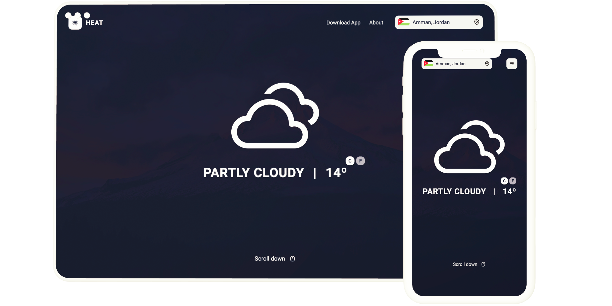

<div align="center">
  

  <h3 align="center">Heat - Weather Application</h3>

  <p align="center">
    Heat is a weather application that displays the weather data in your area when you visit. Also, you can search the weather for other places in the world.
    <br />
    <br />
    <br />
    <a target="_blank" href="https://heat.devsdash.com/">View Demo</a>
    ·
    <a target="_blank" href="https://github.com/ahmadfsalameh/weather/issues">Report Bug</a>
    ·
    <a target="_blank" href="https://github.com/ahmadfsalameh/weather/issues">Request Feature</a>
  </p>

  
</div>

## Built With

- [React.js](https://reactjs.org/)
- Javascript
- CSS

<p align="right">(<a href="#top">back to top</a>)</p>

<!-- GETTING STARTED -->

## Getting Started

Let me guide you through installing, setting up the project and getting it up and running on your local machine.

### Installation

1. Clone the repo
   ```sh
   git clone https://github.com/ahmadfsalameh/weather.git
   ```
2. Install NPM packages
   ```sh
   npm install
   ```

### Settings

1.  Create `.env` file with the following code:

    ```sh
    REACT_APP_WEATHER_API=[weatherapi.com API Key]
    REACT_APP_IP_API=[ipgeolocation.io API key]
    ```

    Please fill in the correct values for your API keys. For more information: <a href="https://weatherapi.com" target="_blank">weatherapi.com</a> | <a href="https://weatherapi.com" target="_blank">ipgeolocation.io</a>..

    And you're ready 😀! Just run `npm start`.

<p align="right">(<a href="#top">back to top</a>)</p>

<!-- CONTACT -->

## Contact

[Ahmad Salameh](https://ahmadsalameh.devsdash.com) - ahmadsalameh@devsdash.com

<p align="right">(<a href="#top">back to top</a>)</p>

<!-- ACKNOWLEDGMENTS -->

## Acknowledgments

Some of the amazing libraries that I've used in this project.

- [React Icons](https://react-icons.github.io/react-icons/search)

<p align="right">(<a href="#top">back to top</a>)</p>
